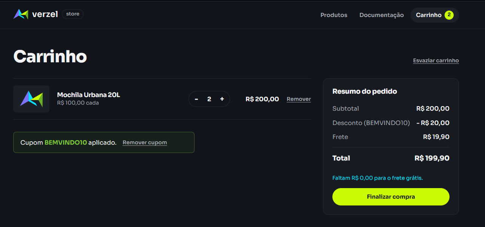

# BUG-01: API não concede frete grátis quando o subtotal é exatamente R$ 200,00

- **Severidade:** Alta
- **Prioridade:** Alta
- **Critério violado:** CA06 (frete grátis para subtotal a partir de R$ 200,00, **inclusive**)
- **Cenários:** CT-FRE-02, CT-FRE-03, CT-FRE-07 (interface) e CT-API-10, CT-API-11 (API)
- **Ambiente:** Verzel Store v2.3.0, Chrome e Postman, 08 e 09/10/2026

**Justificativa da severidade:** erro financeiro numa regra explícita dos critérios de aceite. O cliente paga R$ 19,90 indevidos num valor de subtotal fácil de atingir (2 Mochilas, 4 Garrafas Térmicas).
**Justificativa da prioridade:** afeta o valor cobrado e a regra principal da funcionalidade nova, e a correção provavelmente é simples (operador de comparação do limite).

## Passos para reproduzir (interface)
1. Acessar a loja e adicionar "Mochila Urbana 20L" (R$ 100,00) ao carrinho.
2. Abrir o carrinho e aumentar a quantidade para 2.

## Resultado esperado
Subtotal R$ 200,00, frete grátis e total R$ 200,00.

## Resultado obtido
Subtotal R$ 200,00, frete R$ 19,90 e total R$ 219,90. O carrinho exibe "Faltam R$ 0,00 para o frete grátis.", o que contradiz a cobrança do frete.


## Passos para reproduzir (API)
`POST /api/carrinho/calcular` com:
```json
{ "itens": [ { "produtoId": "P005", "quantidade": 2 } ] }
```

| Campo | Obtido | Esperado |
|-------|--------|----------|
| subtotal | 200 | 200 |
| frete | **19.9** | 0 |
| freteGratis | **false** | true |
| valorFaltanteFreteGratis | 0 | 0 |
| total | **219.9** | 200 |

A resposta é inconsistente em si: `valorFaltanteFreteGratis` é 0 e `freteGratis` é false ao mesmo tempo.


## Outras reproduções
- **Outra composição (CT-FRE-03):** 4 Garrafas Térmicas (R$ 50,00 cada), subtotal R$ 200,00, frete R$ 19,90.
  
- **Com cupom (CT-FRE-07):** 2 Mochilas com BEMVINDO10. Obtido: desconto R$ 20,00, frete R$ 19,90, total R$ 199,90. Esperado: frete grátis e total R$ 180,00.
  
- **Com cupom na API (CT-API-11):** P005 x2 com BEMVINDO10. Obtido: frete 19.9, `freteGratis` false e total 199.9. Esperado: frete 0 e total 180.
  

## Delimitação
- Subtotal R$ 229,90 (1 Jaqueta) e R$ 300,00 (3 Mochilas): frete grátis, correto (CT-FRE-05).
- Subtotal R$ 209,60 com cupom (CT-API-11b): frete grátis e total R$ 188,64, correto. O CA08 (frete considera o subtotal antes do desconto) está correto fora do limite exato.
- Subtotal R$ 199,60 (CT-FRE-04): frete R$ 19,90 e faltante R$ 0,40, correto.
- Subtotal **exatamente** R$ 200,00: frete cobrado, em todas as composições testadas, com ou sem cupom.

O defeito está **na API**: a interface apenas exibe o que a API calcula, como diz a documentação.

**Hipótese:** comparação `subtotal > 200` no lugar de `subtotal >= 200`.

## Limitação
No limite exato, o CA08 não pode ser validado de ponta a ponta, porque o frete é cobrado mesmo sem cupom. Ele foi validado fora do limite (CT-API-11b).

## Automação
Reproduzido em `automacao/tests/frete.spec.ts` (CT-FRE-02), marcado com `test.fail()` até a correção.


