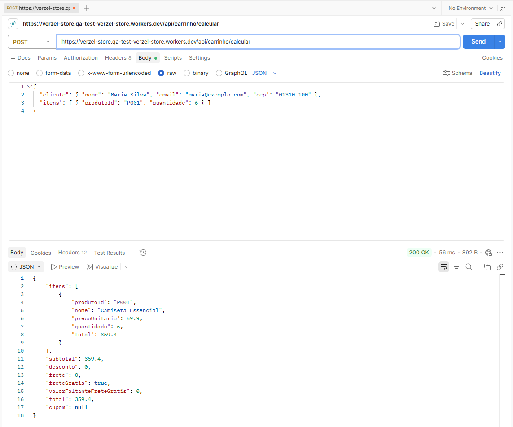
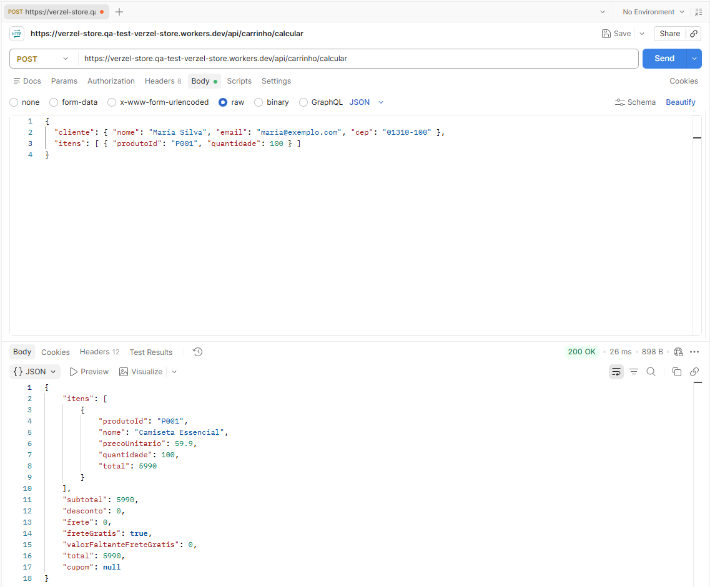

# BUG-02: API não aplica o limite de 5 unidades por produto (cálculo e pedido)

- **Severidade:** Alta
- **Prioridade:** Alta
- **Critério violado:** CA10 (máximo de 5 unidades por produto, na interface **e na API**). A tabela de erros prevê `422 QUANTIDADE_MAXIMA_EXCEDIDA`.
- **Cenário:** CT-API-12
- **Ambiente:** Verzel Store v2.3.0, Postman, 08 e 09/10/2026

**Justificativa da severidade:** a regra pode ser contornada chamando a API diretamente, e a confirmação do pedido aceita quantidades acima do limite.
**Justificativa da prioridade:** a regra está nos critérios de aceite e o impacto vai até a criação do pedido.

## Passos para reproduzir
1. `POST /api/pedidos` com cliente válido e item `P001` com `quantidade: 6`.
2. `POST /api/carrinho/calcular` com `P001` e `quantidade: 6`, e depois `quantidade: 100`.

## Resultado esperado
Status 422 e `erro.codigo` igual a `QUANTIDADE_MAXIMA_EXCEDIDA`.

## Resultado obtido
| Rota | Quantidade | Obtido |
|------|------------|--------|
| `/api/pedidos` | 6 | **201 Created**, pedido `VZ-525694`, total 359.4 |
| `/api/carrinho/calcular` | 6 | **200 OK**, subtotal 359.4 |
| `/api/carrinho/calcular` | 100 | **200 OK**, subtotal 5990 |

## Delimitação
- 5 unidades (o máximo) é aceito (CT-API-13), como esperado.
- O problema começa em 6 unidades e vale para as duas rotas.

## Interface
CT-QTD-02 e CT-QTD-03 (passar de 5 unidades no carrinho): **passaram**. A interface não permite ultrapassar 5 unidades por produto e a quantidade permanece em 5. O defeito está restrito à API, que não replica a regra do CA10.

## Automação
Reproduzido em `automacao/tests/api-quantidade.spec.ts` (CT-API-12), marcado com `test.fail()` até a correção.

